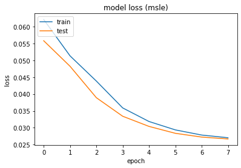
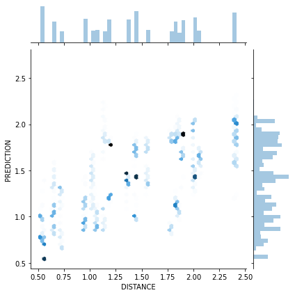

```python
# Copyright © 2020, Johan Vonk
# SPDX-License-Identifier: MIT
```


```python
%matplotlib inline
import numpy as np
import pandas as pd
import math
import matplotlib.pyplot as plt
from sklearn.manifold import MDS
from sklearn.metrics import pairwise_distances
import paho.mqtt.client as mqtt
from threading import Timer
import json
from config import username, password
import seaborn as sns
```


```python
measured=np.array([
    [0, 37.9, 92.2, 95.2, 56.6, 95.5, 73.5, 56.7, 121.2, 73.9],
    [0, 0, 54.7, 71.8, 44.4, 59.4, 41.6, 21.9, 89.5, 46.8],
    [0, 0, 0, 60.3, 67.6, 27.3, 45.8, 42.3, 65.1, 43.5],
    [0, 0, 0, 0, 40.4, 87.1, 94.8, 78.9, 125.4, 25.4],
    [0, 0, 0, 0, 0, 86.9, 81.3, 61.5, 123.0, 28.0],
    [0, 0, 0, 0, 0, 0, 29.1, 39.1, 28.3, 67.2],
    [0, 0, 0, 0, 0, 0, 0, 20.6, 48.6, 70.0],
    [0, 0, 0, 0, 0, 0, 0, 0, 67.6, 53.5],
    [0, 0, 0, 0, 0, 0, 0, 0, 0, 105.5],
    [0, 0, 0, 0, 0, 0, 0, 0, 0, 0],
])
measured*=0.0254
measured+=measured.T
model = MDS(n_components=2, metric=True, dissimilarity='precomputed', random_state=1, n_init=1000, max_iter=1000)
positions = model.fit_transform(measured)
positions -= positions[8]
positions[:, 1]*=-1
theta=np.radians(221)+math.atan2(positions[5,1],positions[5,0])
positions=positions.dot([[np.cos(theta), -np.sin(theta)],
                         [np.sin(theta),  np.cos(theta)]])
positions[:,0]-=positions[3,0]
angles=np.radians([18,9,-18,135,156,-59,-23,77,-90,62])
plt.quiver(positions[:,0], positions[:,1], np.cos(angles), np.sin(angles))
```


    <matplotlib.quiver.Quiver at 0x15fa93c1c48>


```python
devices=pd.DataFrame(columns=("name", "address", "version", "date"))
df=pd.DataFrame(columns=("TIMESTAMP","SCANNER","ADVERTISER","TX POWER","RSSI","DISTANCE","ANGLE"))
class RepeatTimer(Timer):
    def run(self):
        while not self.finished.wait(self.interval):
            self.function(*self.args, **self.kwargs)

def switch_devices(client, devices):
    for device,payload in zip(devices["name"],np.random.choice(['scan', 'adv'],len(devices))):
        client.publish("blescan/ctrl/"+device, payload=payload)

def on_connect(client, userdata, flags, rc):
    client.subscribe("blescan/data/#")
    client.publish("blescan/ctrl", payload="who")
    client.publish("blescan/ctrl", payload="int 2")

def on_message(client, userdata, msg):
    source=msg.topic.rsplit('/', 1)[-1]
    data = json.loads(msg.payload.decode('ASCII').replace('""','"'))
    if "name" in data and data["name"] not in devices["name"].values:
        devices.loc[len(devices)]=[data["name"],data["address"],data["version"],data["date"]]
    elif "RSSI" in data and data["address"] in devices["address"].values and source in devices["name"].values:
        sc_pos=positions[int(source.replace("esp32-",""))-1]
        advertiser=devices[devices['address']==data['address']]['name'].values[0]
        ad_pos=positions[int(advertiser.replace("esp32-",""))-1]
        dx=sc_pos[0]-ad_pos[0]
        dy=sc_pos[1]-ad_pos[1]
        df.loc[len(df)]=[pd.Timestamp.now(),source,advertiser,data["txPwr"],data["RSSI"],math.sqrt(dx**2+dy**2),(math.atan2(dy,dx)-angles[int(advertiser.replace("esp32-",""))-1]+2*np.pi)%(2*np.pi)]

client=mqtt.Client("reader")
client.on_connect = on_connect
client.on_message = on_message
client.connect('mqtt.vonk', 1883)
client.username_pw_set(username=username,password=password)
timer = RepeatTimer(60, switch_devices, args=(client,devices))
try:
    client.loop_start()
    timer.start()
except KeyboardInterrupt:
    client.loop_stop()
    timer.cancel()
```


```python
d=df.copy()
d['TIMESTAMP']=pd.to_datetime(d['TIMESTAMP'],errors='coerce')
d['SCANNER']=d['SCANNER'].astype(str)
d['ADVERTISER']=d['ADVERTISER'].astype(str)
d['TX POWER']=pd.to_numeric(d['TX POWER'],errors='coerce').astype('int8')
d['RSSI']=pd.to_numeric(d['RSSI'],errors='coerce').astype('int8')
d['DISTANCE']=pd.to_numeric(d['DISTANCE'],errors='coerce')
d['ANGLE']=pd.to_numeric(d['ANGLE'],errors='coerce')
angle_shift=(1-np.cos(2*d['ANGLE']))/d['ANGLE']*3-0.855
d['HUMAN PREDICTION']=10**((11.5511+d['TX POWER']-d['RSSI']-angle_shift)/10/2)
d['HUMAN PREDICTION']=pd.to_numeric(d['HUMAN PREDICTION'],errors='coerce')
d['HUMAN SLE']=np.log((d['DISTANCE']+1)/(d['HUMAN PREDICTION']+1))**2
d['HUMAN SLE']=pd.to_numeric(d['HUMAN SLE'],errors='coerce')
```


```python
print('Received {0:.5} messages per second.'.format(len(df)/(df.iloc[-1]["TIMESTAMP"]-df.iloc[0]["TIMESTAMP"]).total_seconds()))
print("Human Prediction is {0:.3%} off in median case.".format(np.abs(d['ERROR']).median()))
print("Mean squared log error is {0:.5}.".format(np.sum(d['HUMAN SLE'])/len(d)))
plot_data=d.query('`HUMAN PREDICTION`>0 and `HUMAN PREDICTION`<4')
sns.jointplot(x="DISTANCE", y="HUMAN PREDICTION", data=plot_data, kind="hex")
```

    Received 7.7524 messages per second.
    Estimate is 6.930% off in median case.
    Mean squared log error is 0.31112.
    


    <seaborn.axisgrid.JointGrid at 0x15fc31feb08>


```python
import tensorflow as tf
from tensorflow.keras.models import Sequential
from tensorflow.keras.layers import Dense
from sklearn.model_selection import train_test_split
from sklearn.preprocessing import StandardScaler
```


```python
power=10**((11.5511+d['TX POWER']-d['RSSI'])/20)
cos_2angle=np.cos(2*d['ANGLE'])
sin_2angle=np.sin(2*d['ANGLE'])
cos_angle=np.cos(d['ANGLE'])
sin_angle=np.sin(d['ANGLE'])
X = pd.DataFrame([power,cos_2angle,sin_2angle,cos_angle,sin_angle]).T
y = np.ravel(d['DISTANCE'])
X_train, X_test, y_train, y_test = train_test_split(X, y, test_size=0.33, random_state=42)
```


```python
scaler = StandardScaler().fit(X_train)
X_train = scaler.transform(X_train)
X_test = scaler.transform(X_test)
```


```python
model = Sequential()
model.add(Dense(8, kernel_initializer='normal', activation='relu', input_shape=(5,)))
model.add(Dense(8, kernel_initializer='normal', activation='relu'))
model.add(Dense(1, kernel_initializer='normal'))
model.compile(loss='mean_squared_logarithmic_error',
              optimizer='sgd',
              metrics=['mse'])
history = model.fit(X_train, y_train, epochs=16, batch_size=32, verbose=1, validation_data=(X_test, y_test))
```

    Train on 290828 samples, validate on 143245 samples
    Epoch 1/8
    290828/290828 [==============================] - 169s 583us/sample - loss: 0.0621 - mse: 0.3360 - val_loss: 0.0558 - val_mse: 0.3057
    Epoch 2/8
    290828/290828 [==============================] - 179s 614us/sample - loss: 0.0513 - mse: 0.2801 - val_loss: 0.0482 - val_mse: 0.2638s: 0.0514 - ms - ETA: 2s - loss: 0.0514 - mse: 0.280 - ETA: 2s - loss: 0.0514 - mse - ETA: 1s - loss: 0.0514 - mse: 0.280 - ETA: 1s - los
    Epoch 3/8
    290828/290828 [==============================] - 185s 637us/sample - loss: 0.0439 - mse: 0.2428 - val_loss: 0.0389 - val_mse: 0.2225
    Epoch 4/8
    290828/290828 [==============================] - 187s 642us/sample - loss: 0.0359 - mse: 0.2033 - val_loss: 0.0334 - val_mse: 0.1863
    Epoch 5/8
    290828/290828 [==============================] - 184s 631us/sample - loss: 0.0319 - mse: 0.1793 - val_loss: 0.0304 - val_mse: 0.1725
    Epoch 6/8
    290828/290828 [==============================] - 192s 662us/sample - loss: 0.0294 - mse: 0.1658 - val_loss: 0.0284 - val_mse: 0.1612- mse
    Epoch 7/8
    290828/290828 [==============================] - 212s 730us/sample - loss: 0.0278 - mse: 0.1578 - val_loss: 0.0272 - val_mse: 0.1556
    Epoch 8/8
    290828/290828 [==============================] - 172s 591us/sample - loss: 0.0271 - mse: 0.1540 - val_loss: 0.0267 - val_mse: 0.1523ss: 0.0271 - ETA: 8s - loss: 0.0 - ETA: 6 - ETA: 1s - loss: 
    


```python
X_predict=scaler.transform(X)
d['PREDICTION']=model.predict(X_predict, verbose=1)
```

    434073/434073 [==============================] - 105s 242us/sample
    


```python
d['SLE']=np.log((d['DISTANCE']+1)/(d['PREDICTION']+1))**2
d=d.rename(columns={'MODEL MSLE':'SLE'})
d.to_csv(f"pact_{d.iloc[0]['TIMESTAMP']:%Y%m%dT%H%M%S}.csv")
```


```python
plt.plot(history.history['loss'])
plt.plot(history.history['val_loss'])
plt.title('model loss (msle)')
plt.ylabel('loss')
plt.xlabel('epoch')
plt.legend(['train', 'test'], loc='upper left')
```


    <matplotlib.legend.Legend at 0x15fc121c9c8>





```python
plot_data=d.query('`PREDICTION`>0 and `PREDICTION`<4')
sns.jointplot(x="DISTANCE", y="PREDICTION", data=plot_data, kind="hex")
```


    <seaborn.axisgrid.JointGrid at 0x15fc2583948>




